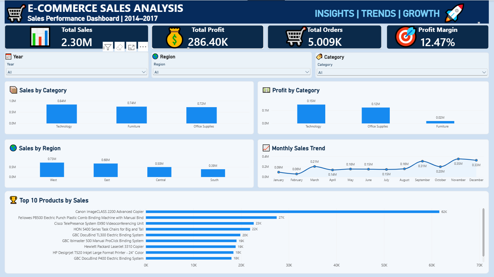
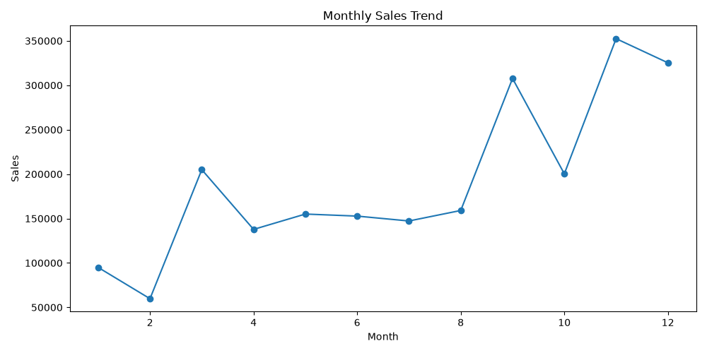
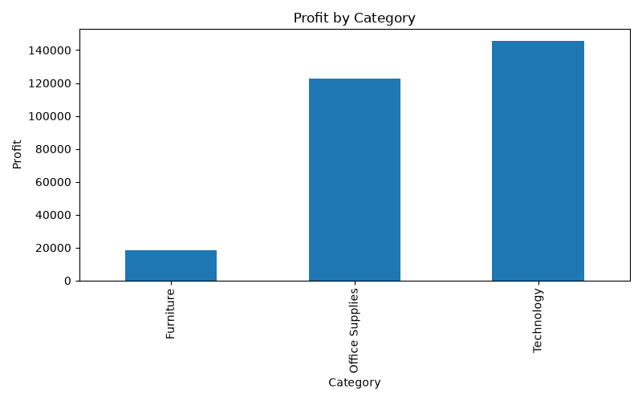
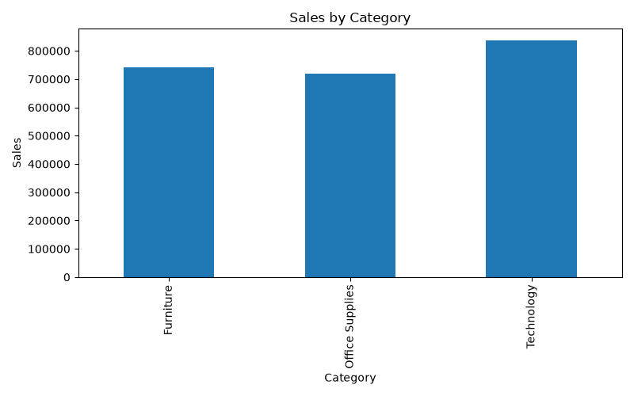
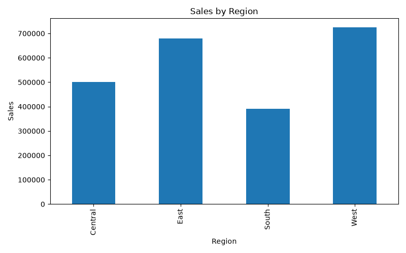

# 🛒 E-Commerce Sales Analysis Dashboard

An end-to-end **E-Commerce Sales Analysis** project built using **Python, Pandas, SQL, MySQL, and Power BI** to clean, analyze, visualize, and present sales and profitability data from the Superstore dataset.

The project demonstrates a complete data analytics workflow, starting from raw transactional data and progressing through data cleaning, exploratory analysis, SQL-based business analysis, and an interactive Power BI dashboard.

---

## 📊 Dashboard Preview



The interactive Power BI dashboard provides an overview of:

- Total Sales
- Total Profit
- Total Orders
- Profit Margin
- Sales by Category
- Profit by Category
- Sales by Region
- Monthly Sales Trends
- Top 10 Products by Sales
- Year, Region, and Category filters

---

## 📈 Analysis Visualizations

### Monthly Sales Trend



Shows monthly sales patterns and helps identify periods of higher and lower sales activity.

### Profit by Category



Compares profitability across the major product categories.

### Sales by Category



Shows the contribution of different product categories to overall sales.

### Sales by Region



Compares sales performance across different geographical regions.

---

## 🎯 Project Overview

This project analyzes e-commerce sales performance across multiple business dimensions, including:

- Time
- Product Category
- Sub-Category
- Region
- State
- Customer Segment
- Shipping Mode
- Product
- Customer
- Discount
- Sales
- Profit

The objective is to transform transactional data into meaningful **KPIs, trends, comparisons, and business insights** using data analytics and visualization techniques.

---

## 📂 Dataset

The project uses the **Superstore dataset** for analysis.

The cleaned dataset contains:

| Metric | Value |
|---|---:|
| Transaction Records | 9,994 |
| Unique Orders | 5,009 |
| Unique Customers | 793 |
| Columns | 23 |
| Total Sales | ₹2.30M |
| Total Profit | ₹286K |

### Dataset Columns

The dataset includes fields such as:

- Row ID
- Order ID
- Order Date
- Ship Date
- Ship Mode
- Customer ID
- Segment
- Country
- City
- State
- Region
- Product ID
- Category
- Sub-Category
- Product Name
- Sales
- Quantity
- Discount
- Profit
- Year
- Month
- Quarter
- Month Number

---

## 🎯 Business Objectives

The main objectives of this project are:

- Analyze overall sales and profit performance
- Identify yearly and monthly sales trends
- Compare product categories and sub-categories
- Analyze regional and state-level performance
- Evaluate customer segments
- Analyze shipping mode performance
- Identify top-performing products and customers
- Examine the relationship between discounts and profitability
- Identify loss-making sub-categories
- Calculate year-over-year sales growth
- Calculate profit margins by category
- Create an interactive business intelligence dashboard
- Present data-driven insights in a clear and understandable format

---

## 🛠️ Tools & Technologies

| Tool / Technology | Purpose |
|---|---|
| **Python** | Data analysis and processing |
| **Pandas** | Data cleaning, manipulation, and analysis |
| **NumPy** | Numerical operations |
| **SQL / MySQL** | Business analysis and KPI queries |
| **Power BI** | Interactive dashboard and reporting |
| **Matplotlib** | Data visualization |
| **CSV** | Dataset storage and handling |

---

## 🔄 Project Workflow

```text
Raw Superstore Dataset
        ↓
Data Cleaning & Preparation
        ↓
Python / Pandas Analysis
        ↓
SQL Business Analysis
        ↓
Power BI Dashboard Development
        ↓
Business Insights & Reporting
